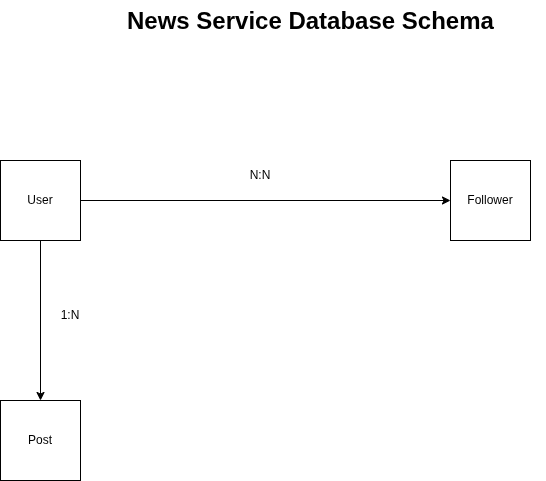

### Database Schema Details

- There are 3 tables: User, Post and Follower
- Users can have many followers and a follower can have many users as followers
- A User can have multiple posts but a post can only be owned by a single User

